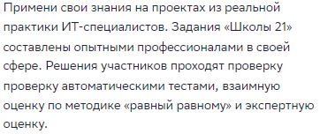

# Статус проверок раздела «Как мы учим»

| Категория | Проверка | Статус |
| :--- | :--- | :--- |
| **UI и адаптивность** | Проверить визуальное оформление раздела (цвета, шрифты, иконки, изображения должны соответствовать общему стилю школы и не вызывать визуального дискомфорта). | pass |
| **UI и адаптивность** | Убедиться, что дизайн соответствует бренду (использование фирменных цветов, логотипа, корпоративных элементов). | pass |
| **UI и адаптивность** | Проверить адаптивность на мобильном устройстве с разрешением 430x932 (контент должен корректно масштабироваться, не накладываться, шрифты оставаться читаемыми). | pass |
| **UI и адаптивность** | Оценить качество изображений и иллюстраций (они должны быть чёткими, не пиксельными, соответствовать тематике обучения). | pass |
| **UI и адаптивность** | Корректное отображение и верстка страницы в целевых браузерах: Google Chrome, Mozilla Firefox, Microsoft Edge. | pass |
| **Контент и информация** | Удостовериться, что описан ключевой принцип обучения — методология «Peer‑to‑Peer» (равный равному) (смысл: показать, что в школе нет лекций и преподавателей, участники учатся друг у друга). | pass |
| **Контент и информация** | Понятность, логика изложения и отсутствие орфографических/грамматических ошибок в текстах. | fail |
| **Контент и информация** | Проверка читабельности текста (контрастность): Текст должен быть легко читаем (черный/темно-серый на белом фоне), отсутствие «светло-серого на белом». | pass |
| **Навигация и ссылки** | Проверить все ссылки внутри раздела (они должны вести на соответствующие страницы, например, «О «Школе 21»», «Поступающим», «Подробнее о платформе»). | pass |
| **Навигация и ссылки** | Убедиться, что кнопки призыва к действию (например, «Вход») работают и ведут на нужную форму или страницу. | pass |
| **Безопасность и производительность** | Наличие валидного SSL-сертификата (работа по защищенному протоколу HTTPS). | pass |
| **Безопасность и производительность** | Проверка скорости загрузки медиа-контента: Изображения и тяжелые элементы не должны тормозить появление текста (LCP в пределах нормы, страница отрисовывается быстро). | pass |

---

# Баг-репорт: #21-001

| Поле | Значение |
| :--- | :--- |
| **Заголовок** | Орфографическая ошибка (дублирование слова) в описании блока «Практико-ориентированный подход» |
| **Серьезность** | Minor |
| **Приоритет** | Low  |
| **Описание** | В текстовом блоке под заголовком «Практико-ориентированный подход» слово «проверку» ошибочно продублировано два раза подряд. |
| **Шаги воспроизведения** | 1. Перейти на страницу: `https://21-school.ru/methodology`  2. Прокрутить страницу вниз до блока «Практико-ориентированный подход».  3. Изучить текстовое описание, начинающееся со слов «Примени свои знания...». |
| **Фактический результат** | Текст содержит повтор слова: «...проходят ``проверку проверку`` автоматическими тестами...» |
| **Ожидаемый результат** | Текст не содержит орфографических ошибок и дублей.  Правильный вариант: «...проходят ``проверку`` автоматическими тестами...» |
| **Окружение** | ОС: любая (Cross-platform)  Браузер: любой (Cross-browser) |
| **Вложения** |  |
| **Дополнительная информация** | Дефект статичен, воспроизводится на любых разрешениях экранов (Desktop/Mobile) и не зависит от кэша браузера. |

