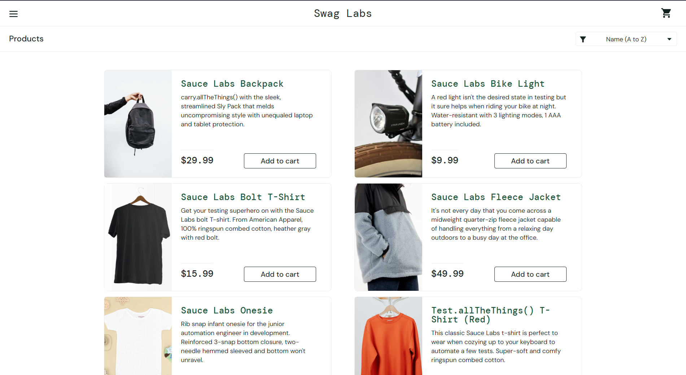
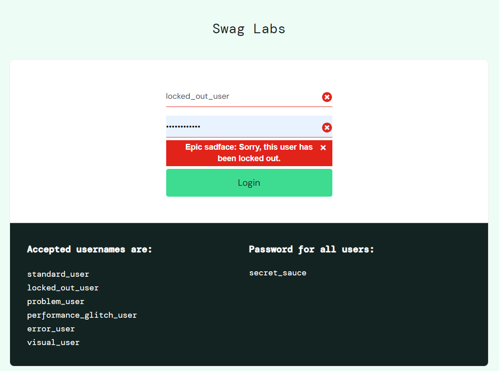
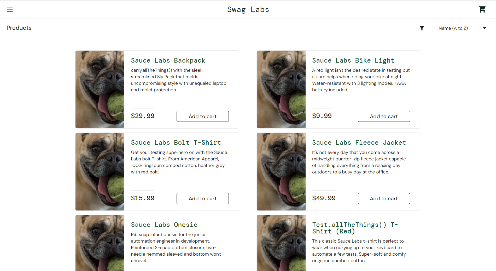
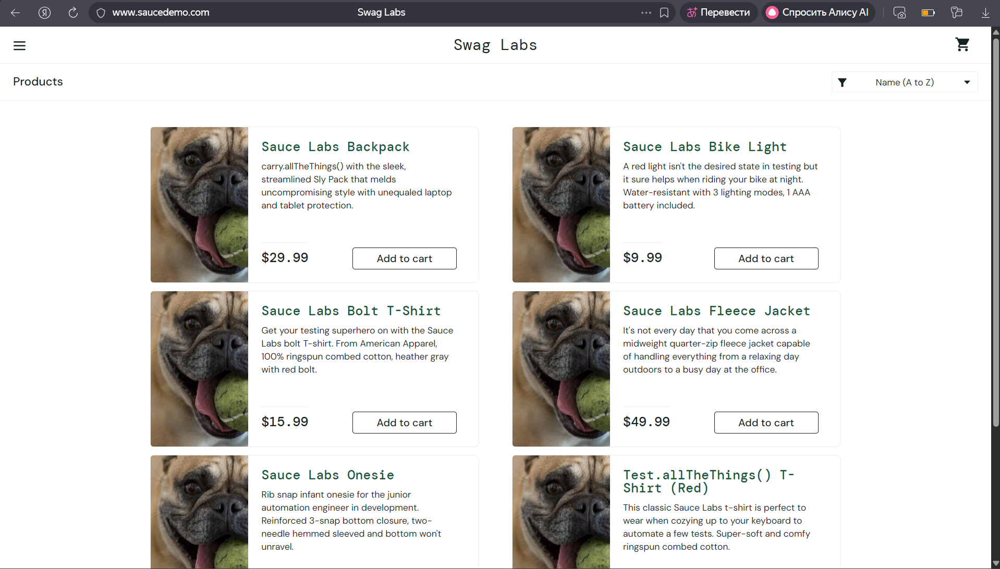

## 1. Тест-кейсы

### TC-001. Успешная авторизация (standard_user)

| Компонент | Описание |
| :--- | :--- |
| **Шаги** | 1. Открыть страницу `https://www.saucedemo.com/` в браузере. 2. В поле «Username» ввести `standard_user`. 3. В поле «Password» ввести `secret_sauce`. 4. Нажать кнопку «Login». |
| **Ожидаемый результат** | Выполнен переход на страницу `/inventory.html`. Отображаются: меню, корзина, заголовок «Products», список из 6 товаров с уникальными изображениями. |
| **Фактический результат** | Поведение системы полностью соответствует ожидаемому. |
| **Постусловия** | Выйти из системы через меню (Logout). |
| **Статус** | PASS |
| **Вложения** |  |

---

### TC-002. Блокировка входа для locked_out_user

| Компонент | Описание |
| :--- | :--- |
| **Шаги** | 1. Открыть страницу `https://www.saucedemo.com/`. 2. В поле «Username» ввести `locked_out_user`. 3. В поле «Password» ввести `secret_sauce`. 4. Нажать кнопку «Login». |
| **Ожидаемый результат** | Переход на `/inventory.html` не происходит. Под формой ввода отображается сообщение об ошибке: `"Epic sadface: Sorry, this user has been locked out."`. Введённые данные сохраняются в полях. |
| **Фактический результат** | Сообщение об ошибке появилось, доступ запрещён. |
| **Постусловия** | Закрыть сообщение об ошибке, очистить поля формы. |
| **Статус** | PASS |
| **Вложения** |  |

---

### TC-003. Сбой отображения для problem_user

| Компонент | Описание |
| :--- | :--- |
| **Шаги** | 1. Открыть страницу `https://www.saucedemo.com/`. 2. В поле «Username» ввести `problem_user`. 3. В поле «Password» ввести `secret_sauce`. 4. Нажать кнопку «Login». |
| **Ожидаемый результат** | Вход выполнен, на странице `/inventory.html` отображаются уникальные изображения товаров. |
| **Фактический результат** | Все товары показывают одинаковое изображение-заглушку (собака). |
| **Постусловия** | Выйти из системы через меню (Logout). |
| **Статус** | FAIL |
| **Вложения** |  |

---

## Баг-репорт

### BG-001. Потеря уникальных изображений товаров для problem_user

| Поле | Значение |
| :--- | :--- |
| **Заголовок** | Потеря уникальных изображений товаров на странице каталога (`/inventory.html`) после авторизации под `problem_user` |
| **Приоритет** | High |
| **Серьёзность** | Major |
| **Окружение** | Windows 11, Яндекс.Браузер v24.4, разрешение 1920×1080 |
| **Шаги воспроизведения** | 1. Открыть `https://www.saucedemo.com/`. 2. Ввести `problem_user` в поле «Username». 3. Ввести `secret_sauce` в поле «Password». 4. Нажать «Login». 5. Визуально оценить изображения в карточках товаров. |
| **Ожидаемый результат** | Каждый товар отображается с уникальным изображением, соответствующим его названию (как у `standard_user`). |
| **Фактический результат** | У всех товаров отображается одинаковое изображение-заглушка (собака). |
| **Вложения** |  |
